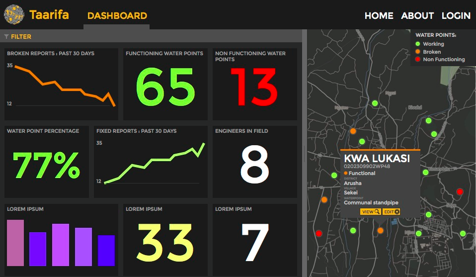
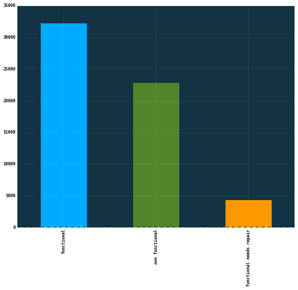

# Pump-it-Up
Drivendata:  Pump it Up: Data Mining the Water Table

[Competition Link](https://www.drivendata.org/competitions/7/pump-it-up-data-mining-the-water-table/)

#### Can you predict which water pumps are faulty?

Using data from Taarifa and the Tanzanian Ministry of Water, can you predict which pumps are functional, which need some 
repairs, and which don't work at all? This is an intermediate-level practice competition. Predict one of these three classes 
based on a number of variables about what kind of pump is operating, when it was installed, and how it is managed. 
A smart understanding of which waterpoints will fail can improve maintenance operations and ensure that clean, potable water 
is available to communities across Tanzania.

#### About Taarifa

The data for this comeptition comes from the Taarifa waterpoints dashboard, which aggregates data from the Tanzania Ministry of Water.
In their own words:
`Taarifa is an open source platform for the crowd sourced reporting and triaging of infrastructure related issues. 
Think of it as a bug tracker for the real world which helps to engage citizens with their local government. 
We are currently working on an Innovation Project in Tanzania, with various partners.`

#### Problem description

Your goal is to predict the operating condition of a waterpoint for each record in the dataset. You are provided the set 
of information about the waterpoints (see the input folder)
Labels are given as below:

The labels in this dataset are simple. There are three possible values:
`functional` - the waterpoint is operational and there are no repairs needed.
`functional needs repair` - the waterpoint is operational, but needs repairs.
`non functional` - the waterpoint is not operational.

#### Evaluation Metric

Classification Rate = \frac{1}{N} \sum_{i=0}^N I(y_i = \hat{y_i}).

The metric used for this competition is the classification rate, which calculates the percentage of rows where the 
predicted class y^ in the submission matches the actual class, y in the test set. The maximum is 1 and the minimum is 0. 
The goal is to maximize the classification rate.

#### Approach

TBD

#### Score

TBD